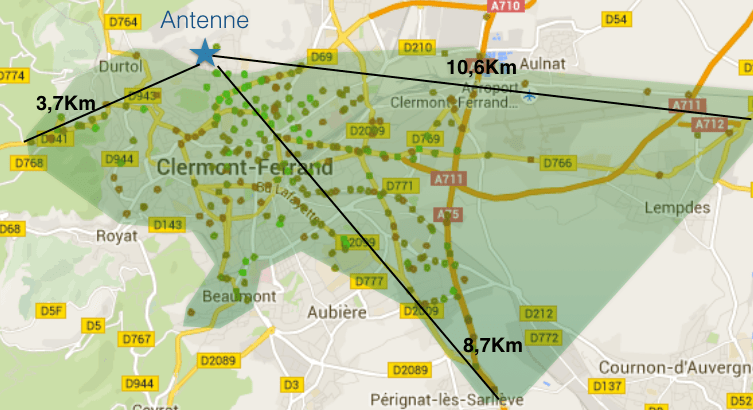
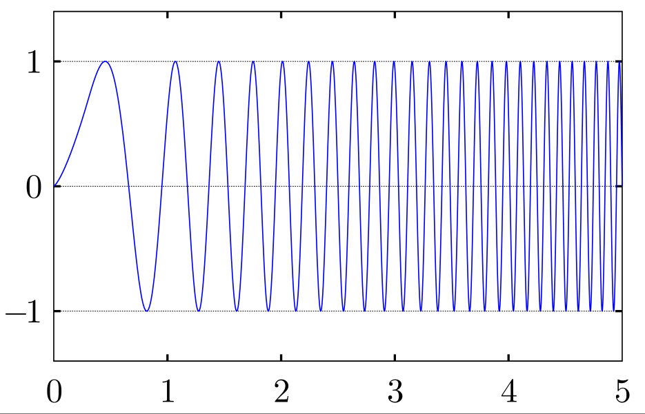

# Idee

## Initiator

{#id .class width=300 height=200px}

##

{#id .class width=300 height=200px}

##

{#id .class width=300 height=200px}

# LoRaWan101

## Was ist LORA?

Funkgebundene Modulation zur Kommunikationsverbindung über Langstrecke in LPWAN[^1] (Layer 1) zur Optimierung von

  * Batterielebensdauer
  * Robustheit
  * Entfernung
  * Kosten

[^1]: Low-Power, Wide-Area-Network  

## Modulation

  - LoRa benutzt CSS für robuste Übertragung.

{#id .class width=300 height=200px}

[^1:]: Frequency Shift Keying

# Umsetzung

## Architecture

{#id .class width=400 height=350px}

## Set up RX

~~~{.python}
    def set_up_rx(self):

        if not self.create_lora():
            self.pdeb("Lora Socket failed")
        else:
            self.pdeb("Lora Socket Raw RX succesfully created")
            if self.basemode == "master":
                self.s.settimeout(10)
        time.sleep(1)

~~~

## Receive Mode

~~~{.python}

    def receive_mode(self):
        try:
            msg = ""
            self.set_up_rx()
            while(True):
                result = self.receive()
                if result == 2: # receive part
                    msg += self.msg
                    self.send("ack",self.cb_output_payload)
                    time.sleep(1)
                if result == 1: #receive finish
                    msg += self.msg
                    self.out_msg(msg,self.last_device_id)
                    self.send("ack",self.cb_output_payload)
                    time.sleep(1)
                    self.mode = "tx"
                    time.sleep(1)
                    break
                if result == 0: # wrong device_id
                    self.pdeb("Not our cup of tea")
                    time.sleep(1)
                    break
        except socket.timeout:
            self.pdeb("Master got Receiver Timeout, changing back to TX")
            self.mode = "tx"
~~~

# Ausblick

## ToDo

  - "Protokollhärtung" - Wiederholtes Senden von Paketen
  - Datenhaltung und Auswertung im Webserver
  - Wechsel auf andere Hardwareplattform ( Dragino ) 
  - Wechsel auf andere Modulation ???

